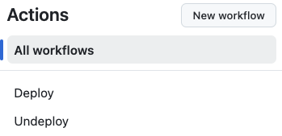
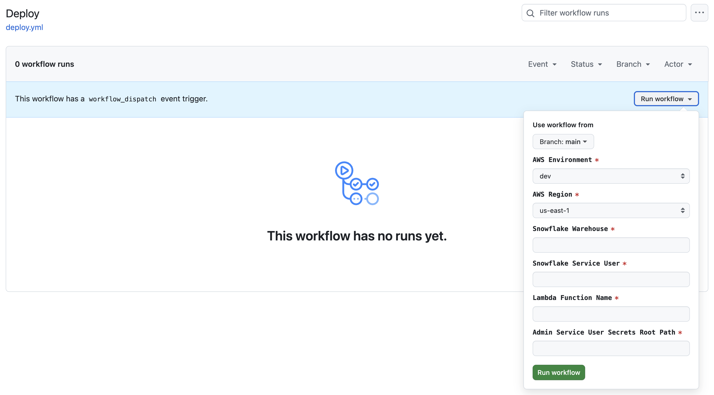
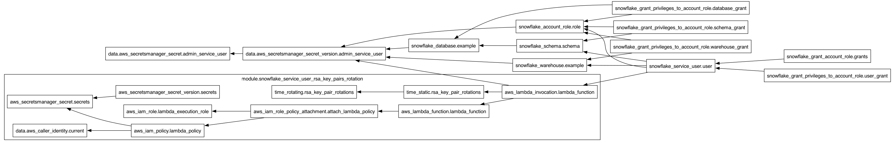

# IaC Snowflake Resources Terraform Configuration
[Terraform](https://terraform.io), an open-source Infrastructure as Code (IaC) tool developed by HashiCorp, uses a declarative approach for managing infrastructure resources. Unlike imperative programming languages like Java, which require explicit, sequential commands to achieve a specific outcome, Terraform enables users to define their desired infrastructure state through configuration files using a YAML-like syntax. This approach abstracts the complexity of manual infrastructure management by allowing users to focus on "what" the final state should be rather than "how" to achieve it.

With Terraform, users can efficiently manage a wide range of [Snowflake resources](https://registry.terraform.io/providers/snowflakedb/snowflake/latest/docs)—including Warehouses, Databases, Schemas, Tables, and Roles/Grants—by defining their desired state in configuration files. Terraform maintains a detailed record of the current state of these resources and compares it against the desired state specified by the user. Based on this comparison, Terraform automatically generates a reconciliation plan to bring the existing infrastructure into alignment with the desired configuration. This process involves creating, updating, or deleting resources as needed, enabling consistent, repeatable, and predictable management of infrastructure components.

The configuration leverages the [IaC Snowflake User RSA key pairs Rotation Terraform module](https://github.com/j3-signalroom/iac-snowflake-user-rsa_key_pairs_rotation-tf_module) to automate the creation and rotation of [RSA key pairs](https://github.com/j3-signalroom/j3-techstack-lexicon/blob/main/cryptographic-glossary.md#rsa-key-pair) for a Snowflake service account user. This module ensures that each RSA key pair is securely rotated based on a defined schedule, reducing the risk of credential compromise and improving the overall security of the data streaming environment.

To protect sensitive credentials, the configuration securely stores the generated RSA key pairs for both resources in AWS Secrets Manager, ensuring that only authorized users and services have access to these credentials. This secure storage method prevents unauthorized access and minimizes the risk of key exposure.

**Table of Contents**

<!-- toc -->
+ [1.0 Let's get started!](#10-lets-get-started)
    - [1.1 Visualizing the Terraform Configuration](#11-visualizing-the-terraform-configuration)
+ [2.0 Resources](#20-resources)
<!-- tocstop -->

## 1.0 Let's get started!
**These are the steps**

1. Take care of the cloud and local environment prequisities listed below:
    > You need to have the following cloud accounts:
    > - [GitHub Account](https://github.com) *with OIDC configured for AWS*
    > - [Snowflake Account](https://www.snowflake.com/en/)
    > - [Terraform Cloud Account](https://app.terraform.io/)

    > You need to have the following installed on your local machine:
    > - [Terraform CLI version 1.12 or newer](https://developer.hashicorp.com/terraform/install)

2. Clone the repo:
    ```bash
    git clone https://github.com/j3-signalroom/snowflake_admin_user_rsa_key_credentials_creation-script.git
    ```

    Then refer to [`snowflake_admin_user_rsa_key_credentials_creation-script README`](https://github.com/j3-signalroom/snowflake_admin_user_rsa_key_credentials_creation-script) to set it up.

3. Clone the repo:
    ```bash
    git clone https://github.com/j3-signalroom/iac-snowflake-user-rsa_key_pairs_and_jwt_generator-lambda.git
    ```

    Then refer to [`iac-snowflake-user-rsa_key_pairs_and_jwt_generator-lambda README`](https://github.com/j3-signalroom/iac-snowflake-user-rsa_key_pairs_and_jwt_generator-lambda) to set it up.

4. Clone the repo:
    ```shell
    git clone https://github.com/j3-signalroom/iac-snowflake-resources-tf.git
    ```

5. Update the cloned Terraform module's [main.tf](main.tf) by following these steps:

    a. Locate the `terraform.cloud` block and replace **`signalroom`** with your [Terraform Cloud Organization Name](https://developer.hashicorp.com/terraform/cloud-docs/users-teams-organizations/organizations).

    b. In the `terraform.cloud.workspaces` block, replace **`iac-snowflake-resources-workspace`** with your [Terraform Cloud Organization's Workspaces Name](https://developer.hashicorp.com/terraform/cloud-docs/workspaces).

6. To run repo's [Terraform configuration](main.tf) locally, follow these steps:

    a. Navigate to the root folder of the `iac-snowflake-resources-tf/` repository that you cloned.

    b. Open a terminal in this directory.

    c. Execute the following [script](./deploy.sh):
    ```shell
    ./deploy.sh <create | delete> --profile=<SSO_PROFILE_NAME> \
                                  --snowflake_warehouse=<SNOWFLAKE_WAREHOUSE> \
                                  --service_account_user=<SERVICE_ACCOUNT_USER> \
                                  --day_count=<DAY_COUNT>
    ```
    Argument placeholder|Replace with
    -|-
    `<SSO_PROFILE_NAME>`|your AWS SSO profile name for your AWS infrastructue that host your AWS Secrets Manager.
    `<SNOWFLAKE_WAREHOUSE>`|the Snowflake warehouse (or "virtual warehouse") you choose to run the resources in Snowflake.
    `<SERVICE_ACCOUNT_USER>`|the Snowflake service account user who is to be assigned the RSA key pairs for its authentication.
    `<DAY_COUNT>`|how many day(s) should the RSA key pairs be rotated for.

7. Or, to run the repository's Terraform configuration from GitHub, follow these steps:

    a. **Deploy the Repository**: Ensure that you have cloned or forked the repository to your GitHub account.

    b. **Set Required Secrets and Variables**: Before running any of the GitHub workflows provided in the repository, you must define at least the `AWS_DEV_ACCOUNT_ID` variable (which should contain your AWS Account ID for your development environment). To do this:

    - Go to the **Settings** of your cloned or forked repository in GitHub.

    - Navigate to **Secrets and Variables** > **Actions**.

    - Add the `AWS_DEV_ACCOUNT_ID` and any other required variables or secrets.

    c. **Navigate to the Actions Page**:

    - From the cloned or forked repository on GitHub, click on the **Actions** tab.

    d. **Select and Run the Deploy Workflow**:

    - Find the **Deploy workflow** link on the left side of the Actions page and click on it.

        

    - On the **Deploy workflow** page, click the **Run workflow** button.

    - A workflow dialog box will appear. Fill in the necessary details and click **Run workflow** to initiate the Terraform deployment process.

        

    By following these steps, you will run the Terraform configuration directly from GitHub, leveraging GitHub Actions for automation and deployment.

### 1.1 Visualizing the Terraform Configuration
Below is the Terraform visualization of the Terraform configuration. It shows the resources and their dependencies, making the infrastructure setup easier to understand.



> **To fully view the image, open it in another tab on your browser to zoom in.**

When you update the Terraform Configuration, to update the Terraform visualization, use the [`terraform graph`](https://developer.hashicorp.com/terraform/cli/commands/graph) command with [Graphviz](https://graphviz.org/) to generate a visual representation of the resources and their dependencies.  To do this, run the following command:

```bash
terraform graph | dot -Tpng > .blog/images/terraform-visualization.png
```

## 2.0 Resources

* [Snowflake Terraform Provider](https://registry.terraform.io/providers/snowflakedb/snowflake/latest/docs)

* [Terraforming Snowflake Quickstart](https://quickstarts.snowflake.com/guide/terraforming_snowflake/index.html?index=..%2F..index#0)